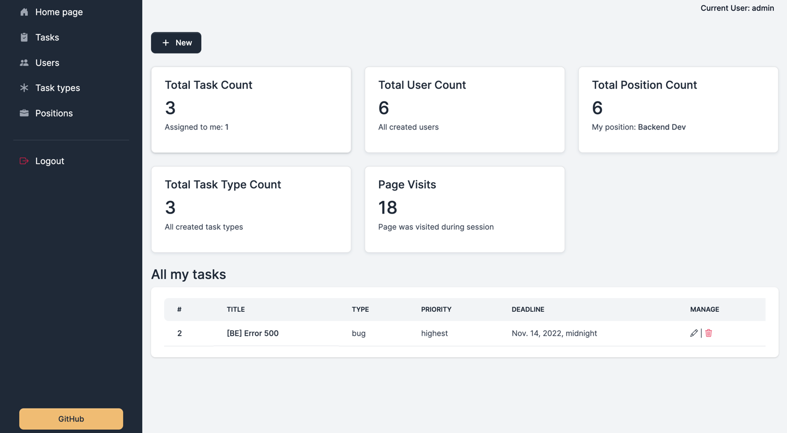

# py-task-manager
Task manager educational project: [deployed on render.com](https://task-manager-project.onrender.com/)

Test user:
- test_user
- userpass_123789

### To install requirements:
`pip install -r requirements.txt`

### Implemented features:
- Authentication
- Managing (create, update, delete) of tasks, workers, positions and task types
- Searching functionality

